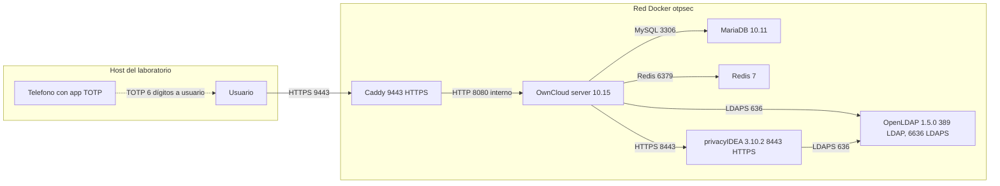
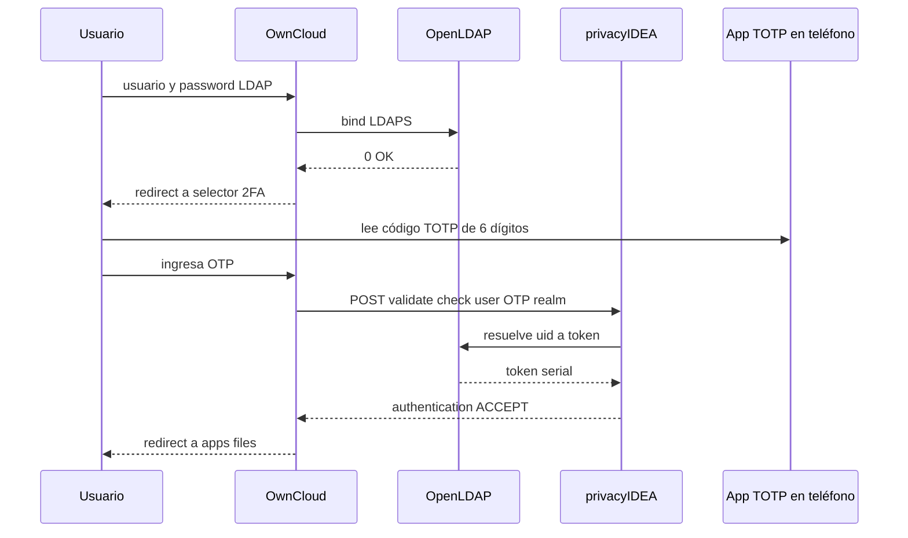
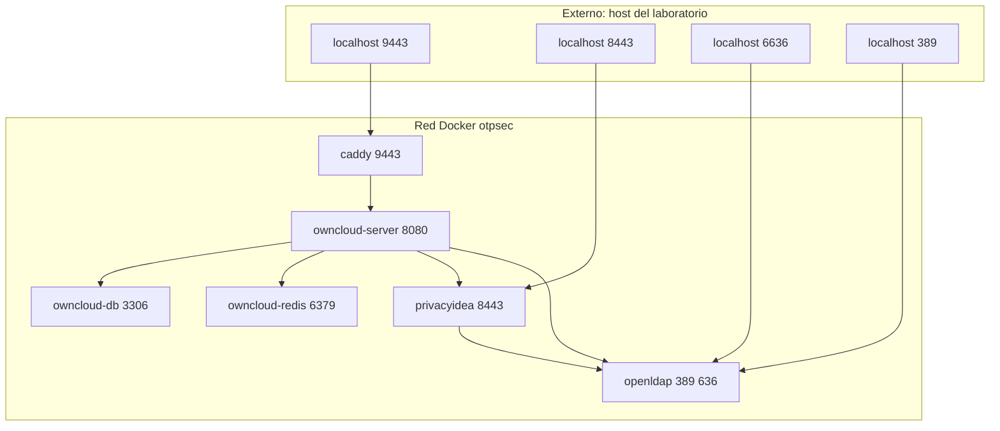

# Arquitectura del sistema

## Componentes y su rol

| Componente | Imagen / Versión | Rol |
|---|---|---|
| OpenLDAP | `osixia/openldap:1.5.0` | Directorio de usuarios, autenticación de primer factor |
| PrivacyIDEA | `privacyIDEA 3.10.2` | Emisión y validación de tokens OTP |
| App TOTP | FreeOTP o Proton Authenticator | Cliente que genera el código TOTP en el móvil del usuario |
| OwnCloud | `owncloud/server:10.15` | Servicio de almacenamiento con integración LDAP y 2FA |
| Caddy | `caddy:2-alpine` | Terminación TLS para OwnCloud en el puerto 9443 |
| MariaDB | `mariadb:10.11` | Base de datos de OwnCloud |
| Redis | `redis:7-alpine` | Cache y locking de OwnCloud |

Los servicios corren como contenedores sobre una red Docker compartida (`otpsec`). El acceso del usuario final es únicamente por HTTPS a OwnCloud; las comunicaciones internas entre OwnCloud, PrivacyIDEA y OpenLDAP son locales en la red Docker.

## Flujo de autenticación 2FA

```
Usuario
  |
  | 1. usuario y contraseña
  v
OwnCloud
  | 2. bind LDAP
  v
OpenLDAP

App TOTP
  |
  | 3. genera TOTP
  v
Usuario
  |
  | 4. captura OTP en OwnCloud
  v
OwnCloud
  |
  | 5. valida OTP
  v
PrivacyIDEA
  |
  | 6. resuelve usuario por UID
  v
OpenLDAP
```

### Pasos del flujo

1. El usuario entrega usuario + contraseña al portal web de OwnCloud.
2. OwnCloud hace `bind` contra OpenLDAP con esas credenciales. Si el bind es correcto queda validado el **primer factor** (capa *autenticación / conozco*).
3. OwnCloud invoca el plugin `twofactor_privacyidea` y redirige al usuario a una pantalla de OTP.
4. El usuario abre **FreeOTP o Proton Authenticator** en el móvil, obtiene el código TOTP de 6 dígitos, y lo introduce.
5. `twofactor_privacyidea` llama a la API de PrivacyIDEA con (`user`, `otpvalue`).
6. PrivacyIDEA resuelve al usuario contra su *resolver LDAP* (apunta al mismo OpenLDAP), localiza el token enrolado, y valida el código.
7. Si PrivacyIDEA responde OK, OwnCloud inicia sesión y queda validado el **segundo factor** (capa *autenticación / tengo*).
8. A partir de aquí, la capa de **autorización** la aplica OwnCloud sobre las carpetas según permisos, y la capa de **auditoría** se escribe a los logs de OwnCloud y PrivacyIDEA.

## Fuente de identidad única

El principio fundamental del diseño es que **OpenLDAP es la única fuente de identidad**. PrivacyIDEA no mantiene usuarios propios: usa el LDAP como *resolver*. Así:

- No hay que crear al usuario en dos lados.
- La baja de un usuario en LDAP lo desactiva automáticamente en OwnCloud y PrivacyIDEA.
- Los UIDs son consistentes en los logs de los tres servicios (útil para auditoría).

## Red y puertos

| Servicio | Puerto interno | Puerto expuesto |
|---|---|---|
| OpenLDAP | 389 (ldap), 636 (ldaps) | 389, 6636 |
| PrivacyIDEA | 8443 (https) | 8443 |
| OwnCloud | 8080 (http interno) | No se expone directo |
| Caddy para OwnCloud | 9443 (https) | 9443 |

OpenLDAP, PrivacyIDEA y Caddy usan certificados firmados por la CA local del proyecto en `certs/`. El resolver LDAP de PrivacyIDEA usa `ldaps://openldap:636` dentro de la red Docker. OwnCloud también usa LDAPS hacia OpenLDAP y HTTPS interno hacia PrivacyIDEA.

## Diagramas para el entregable

Los diagramas de esta sección están en sintaxis Mermaid, que GitHub renderiza nativamente y que se puede exportar a PNG o SVG para incluir en el PDF final con `mermaid-cli` (`mmdc`).

### Figura 1: Arquitectura del sistema



### Figura 3: Flujo de autenticación 2FA



### Figura 4: Red Docker y puertos



## Cómo exportar los diagramas a PNG para el PDF

```bash
npm install -g @mermaid-js/mermaid-cli
./scripts/build-figures.sh
```

El script localiza cada encabezado `### Figura N:` en `docs/arquitectura.md`, `docs/arbol-ldap.md` y `docs/memoria-tecnica.md`, extrae el bloque `mermaid` que sigue y produce `docs/figuras/figuraN.png`. Las imágenes se embeben automáticamente en el PDF y el DOCX cuando se ejecuta `./scripts/build-pdf.sh`.
