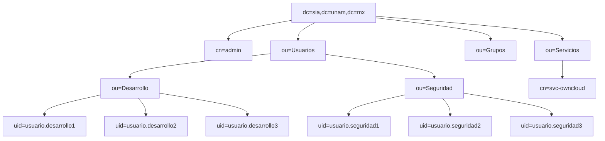
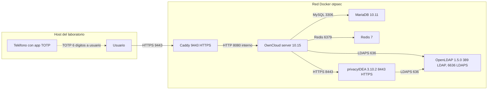
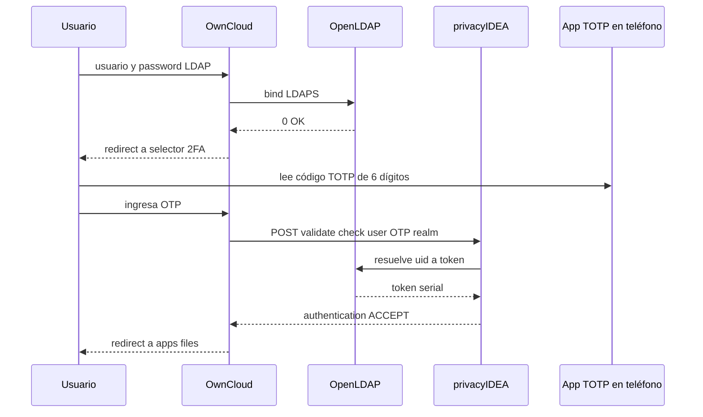
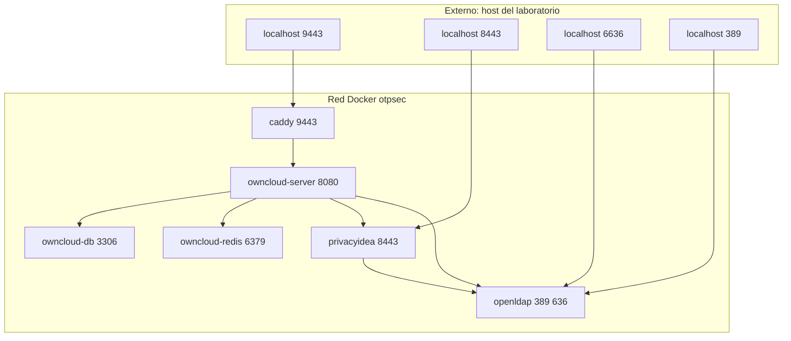
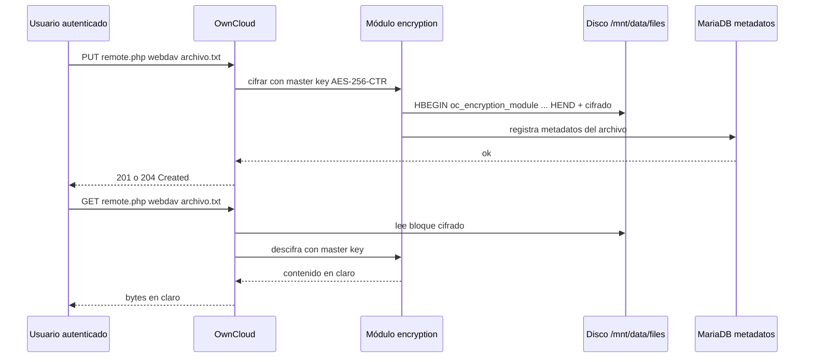
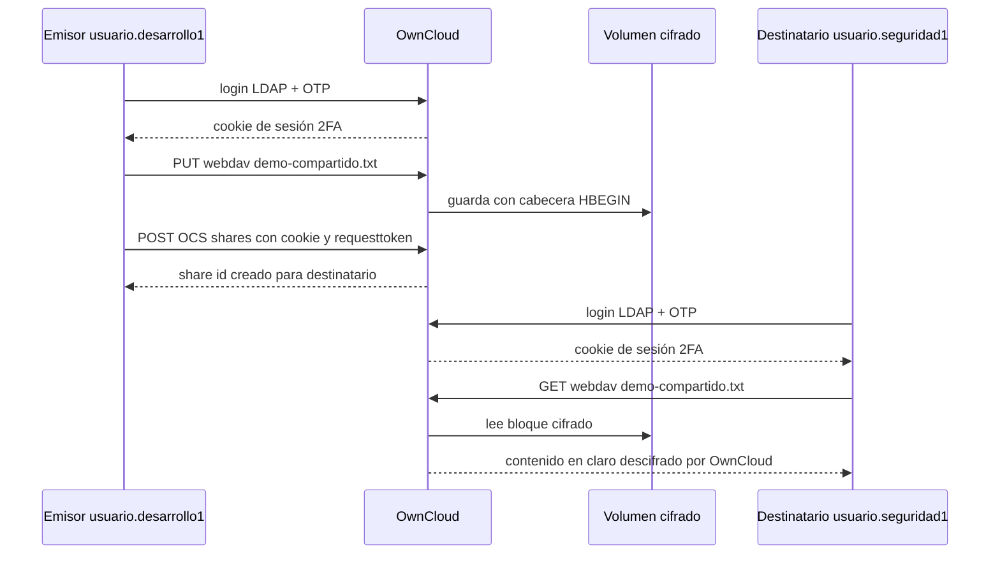

# Universidad Nacional Autónoma de México

## Facultad de Ingeniería

## División de Ingeniería Eléctrica

## Departamento de Computación

---

# Servicio de almacenamiento con autenticación de doble factor por OTP

## Proyecto final de Seguridad Informática Avanzada

### Semestre 2026-2

---

**Equipo:**

| Integrante | Correo |
|---|---|
| Arellanes Conde Esteban | esteban.arellanes@ingenieria.unam.edu |
| Ferreira Rojas Mauricio | mauferreira183@gmail.com |
| López Segundo Luis Iván | lopezsknd@gmail.com |
| Olvera González Arely | arely.olvera@ingenieria.unam.edu |
| Rufino López María Elena | mariaelena.rufino424@gmail.com |
| Salgado Miranda Jorge | ohchochy@gmail.com |

**Profesor:** César Sanabria Pineda

**Fecha de entrega:** 29 de mayo de 2026

**Repositorio GitHub:** https://github.com/chochy2001/otp-secured-cloud


\newpage

# Índice

1. Portada
*Prefacio*
2. Introducción
3. Conceptos básicos de 2FA mediante tokens OTP
4. Diseño del árbol LDAP del proyecto
5. Arquitectura del sistema
6. Memoria técnica paso a paso
   - 6.1 Estructura del repositorio
   - 6.2 Levantamiento del stack
   - 6.3 Identificación: OpenLDAP
   - 6.4 Autenticación primer factor: contraseña LDAP
   - 6.5 Autenticación segundo factor: privacyIDEA y app TOTP
   - 6.6 OwnCloud y orquestación 2FA
   - 6.7 Carpetas compartidas y cifrado del lado destinatario
   - 6.8 Auditoría (complemento académico, no evaluable)
   - 6.9 Reproducibilidad
7. Conclusiones
   - 7.1 Conclusión por equipo
   - 7.2 Conclusiones individuales
8. Glosario de términos
9. Bibliografía
10. Índice de figuras

## Mapeo de secciones a archivos del repositorio

| Sección | Archivo en `docs/` |
|---|---|
| 1. Portada | `portada.md` |
| 2. Introducción | `introduccion.md` |
| 3. Conceptos básicos | `conceptos-basicos.md` |
| 4. Diseño del árbol LDAP | `arbol-ldap.md` |
| 5. Arquitectura | `arquitectura.md` |
| 6. Memoria técnica paso a paso | `memoria-tecnica.md` |
| 7. Conclusiones | `conclusiones.md` |
| 8. Glosario | `glosario.md` |
| 9. Bibliografía | `bibliografia.md` |
| 10. Índice de figuras | `indice-figuras.md` |

`docs/auditoria.md` queda fuera del entregable porque el profesor confirmó que la cuarta capa no se evalúa. Permanece en el repositorio como evidencia complementaria del marco conceptual.


\newpage

# Prefacio

Este prefacio precede al contenido técnico del entregable y responde a tres preguntas que un evaluador puede hacerse al abrir el documento: por qué abordar este problema, cómo decidimos cada pieza y qué construimos al final. Cierra con lo que aprendimos durante la implementación. El propósito es dar contexto narrativo antes de entrar al detalle técnico de las secciones numeradas.

## Por qué este proyecto

El control de acceso es uno de los pilares de la seguridad informática. La asignatura Seguridad Informática Avanzada lo presentó como un marco de cuatro capas (identificación, autenticación, autorización y auditoría) y enfatizó que omitir cualquiera deja huecos explotables. De estas cuatro, la autenticación es la que más atención pública recibe porque es la primera línea de defensa visible para el usuario: la pantalla de inicio de sesión.

La autenticación con un solo factor (usuario + contraseña) sigue siendo el vector de ataque dominante en violaciones de datos reportadas anualmente. La razón es estructural: una contraseña, por compleja que sea, es algo que el usuario sabe y por lo tanto algo que puede ser intercambiado, observado o filtrado sin que el usuario se dé cuenta. Phishing, keyloggers, brechas de bases de datos y reutilización de credenciales producen una superficie de ataque grande con bajo costo para el atacante. La industria identifica que el segundo factor (algo que el usuario tiene) reduce drásticamente el éxito de estos ataques al imponer al atacante la posesión física del dispositivo.

Frente a opciones de segundo factor disponibles (SMS, push notifications, llaves FIDO2/WebAuthn, OTP por software, OTP por hardware), el OTP basado en tiempo (TOTP) ofrece la mejor relación costo/beneficio para un escenario académico y para muchas organizaciones reales: no requiere infraestructura adicional del proveedor (no SMS, no servidores push), funciona offline en el teléfono del usuario, está estandarizado por RFC 6238, y es compatible con docenas de apps gratuitas. Por eso TOTP es el segundo factor de este proyecto.

Decidimos construir un servicio de almacenamiento porque ejercita las cuatro capas del control de acceso en un escenario tangible: usuarios autenticándose con dos factores, autorización por carpetas, cifrado del contenido en disco y bitácoras de cada acceso. Un servicio de archivos privados es más ilustrativo que, por ejemplo, una API pura, porque los archivos compartidos son objetos visibles que el evaluador puede crear, mover, compartir y descifrar durante una demo.

## Cómo decidimos cada pieza

Las siguientes ocho decisiones técnicas estructuran todo el resto del entregable. Cada una se documenta con la alternativa principal descartada y la razón de la elección.

| Decisión | Elección | Alternativas descartadas | Por qué |
|---|---|---|---|
| Plataforma de despliegue | Docker Compose | Máquinas virtuales, Kubernetes | Reproducibilidad inmediata, bajo costo para laboratorio, suficiente para un stack de 6 servicios sin necesidad de orquestación distribuida |
| Directorio de identidad | OpenLDAP en imagen `osixia/openldap:1.5.0` | Active Directory, FreeIPA, Authentik | Software libre, control total del esquema, no requiere licencia ni dominio Windows |
| Servidor de tokens OTP | privacyIDEA 3.10.2 | Authelia, Keycloak, Vault | Especializado en gestión de tokens (no es IdP generalista), integra con OwnCloud vía plugin oficial `twofactor_privacyidea`, soporta enrolamiento programático |
| Servicio de almacenamiento | OwnCloud Server 10.15.3 | OCIS (sucesor en Go), NextCloud | Madurez del ecosistema de plugins relevantes (`user_ldap`, `twofactor_privacyidea`), documentación extensa, encryption module probado |
| Algoritmo OTP | TOTP de 6 dígitos (RFC 6238) | HOTP, push notifications, WebAuthn | Estándar amplio, compatible con FreeOTP, Proton Authenticator, Google Authenticator y similares; no requiere conectividad permanente |
| Cifrado de archivos | Server Side Encryption con master key | E2E del lado cliente, sin cifrado | Soportado nativamente por OwnCloud, transparente para usuarios autorizados, ilustra cifrado en disco con verificación canónica vía cabecera `HBEGIN` |
| Modelo de autorización | LDAP autentica, OwnCloud autoriza | Sincronizar grupos LDAP a OwnCloud | El profesor confirmó este modelo por correo; simplifica el flujo, evita acoplar permisos al directorio, separa responsabilidades de identidad y autorización |
| Estrategia de validación | Verify-first (script `*-verify.sh` antes que `*-configure.sh`) | Solo configurar y asumir que funciona | Evita autoengaño sobre el estado del sistema; cada validación es ejecutable y reportable; cualquier integrante puede demostrar funcionamiento sin recordar comandos |

Estas decisiones se tomaron de forma incremental durante el primer mes del proyecto y se documentaron antes de tocar configuración para evitar retrabajo. Cuando hubo que mover OwnCloud a HTTPS por TLS, por ejemplo, ya estaba claro qué cambiaba en el árbol LDAP, en el resolver de privacyIDEA y en los certificados.

## Qué construimos al final

El entregable cubre los cinco puntos evaluables del PDF del profesor. La siguiente tabla mapea cada uno a la sección del documento que lo describe y al script del repositorio que lo demuestra de forma reproducible. Esta tabla permite al evaluador navegar la entrega desde el requisito hasta la evidencia sin tener que reconstruir el contexto.

| Punto evaluable (PDF del profesor) | Sección de este documento | Evidencia ejecutable |
|---|---|---|
| Alta de usuarios en LDAP | "Diseño del árbol LDAP" | `./scripts/ldap-verify.sh` confirma 6 usuarios humanos, cuenta de servicio separada y LDAPS |
| Integración con privacyIDEA | "Arquitectura del sistema" y "Memoria técnica" | `./scripts/privacyidea-verify.sh` confirma resolver `sia-ldap` y realm `sia` |
| Emisión de OTP en app móvil | "Conceptos básicos" y "Memoria técnica" | `./scripts/privacyidea-enroll-test-token.sh` genera URL `otpauth://` lista para FreeOTP o Proton Authenticator |
| Implementación de OwnCloud | "Arquitectura del sistema" y "Memoria técnica" | `./scripts/owncloud-verify.sh` confirma OwnCloud 10.15, LDAP integrado, plugin 2FA y cifrado activo |
| Integración 2FA LDAP + OTP | "Memoria técnica" (todas las subsecciones) | `./scripts/owncloud-login-verify.sh usuario.desarrollo2` ejecuta el login web completo con primer y segundo factor |
| Autorización y cifrado de archivos compartidos | "Memoria técnica" (subsección shares) | `./scripts/owncloud-share-verify.sh usuario.desarrollo3 usuario.seguridad1` valida share y lectura descifrada por destinatario |

Adicionalmente, el comando `./scripts/bootstrap.sh` desde un clon limpio del repositorio ejecuta todas las fases en orden (generación de certificados, build, levantamiento, configuración, pruebas end-to-end) y termina con el mensaje `Listo` si todo pasó. Es la forma más directa de validar reproducibilidad sin memorizar comandos.

La cuarta capa de control de acceso, auditoría, queda documentada en `docs/auditoria.md` y automatizable con `./scripts/audit-capture.sh` como complemento académico conforme al marco conceptual presentado en la asignatura. Se incluye en el repositorio para no dejar incompleto el marco de cuatro capas, aun cuando la evaluación del proyecto se concentra en identificación, autenticación y autorización.

## Lo que aprendimos durante la implementación

Las siguientes seis decisiones se revisaron durante la construcción del laboratorio. Documentarlas explícitamente sirve a quien lea el entregable para entender que el diseño final no es el primer borrador sino el resultado de iteración contra el comportamiento real del software.

**1. La cuenta de servicio LDAP debe estar separada del árbol de usuarios humanos.** En la primera iteración la cuenta `svc-owncloud` vivía en la misma rama que los usuarios. El conteo de "usuarios humanos" devolvía 7 en lugar de 6 porque el filtro `(objectClass=inetOrgPerson)` la incluía. La solución fue moverla a `ou=Servicios` con `objectClass=simpleSecurityObject` + `organizationalRole`, que no coincide con el filtro humano.

**2. TLS LDAPS debe configurarse desde el primer arranque.** Inicialmente el directorio se levantaba sin LDAPS y se pretendía agregarlo después. Esto requirió re-importar LDIFs, regenerar certificados y reconfigurar privacyIDEA y OwnCloud. La lección: si la decisión arquitectónica es "TLS en todos los canales", se materializa desde el primer LDIF.

**3. El plugin `twofactor_privacyidea` requiere excluir al usuario admin local.** OwnCloud tiene una cuenta `admin` local que no existe en el realm LDAP `sia`. Sin excluirla con `piexclude=1` y `piexcludegroups=admin`, el plugin intentaba validar OTP para una cuenta sin token y bloqueaba el acceso de mantenimiento. La configuración correcta permite operar admin con password simple pero exige OTP para todos los usuarios LDAP.

**4. Los healthchecks de Docker deben usar protocolos reales.** El primer compose usaba `nc -z` (verificación TCP). Esto pasaba aunque el servicio LDAP no estuviera serving requests. La solución fue usar `ldapwhoami -H ldaps://...` para LDAP, `curl -fkSs https://.../status.php` para OwnCloud y similares. El compose ahora arranca servicios cuando dependencias están realmente sanas, no solo cuando el contenedor encendió.

**5. La cabecera `HBEGIN:oc_encryption_module:OC_DEFAULT_MODULE:cipher:AES-256-CTR:HEND` es la prueba canónica de cifrado en disco.** Inicialmente se intentaba demostrar cifrado leyendo el archivo y observando que no era el contenido original. La cabecera explícita es más concreta para evaluación: el formato es del módulo de cifrado de OwnCloud y la presencia de `cipher:AES-256-CTR` documenta el algoritmo exacto sin ambigüedad.

**6. La OCS Sharing API de OwnCloud rechaza Basic Auth cuando 2FA está activo.** El script de prueba de compartidos fallaba con error 401 usando autenticación básica. La razón es de diseño: si una cuenta requiere 2FA, basic auth no puede satisfacerlo en una sola petición. La solución fue obtener una cookie de sesión vía login interactivo (POST a `/index.php/login` con password + segundo POST con OTP) y usar esa cookie para llamar a `/ocs/v2.php/apps/files_sharing/api/v1/shares`. Esto refleja cómo funcionaría un cliente web real.

Estas son seis decisiones representativas; el repositorio contiene más decisiones menores documentadas en commits y en `docs/memoria-tecnica.md`. El propósito de listarlas en el prefacio es mostrar que el diseño final tiene historia y que las elecciones se hicieron con razón, no por accidente.


\newpage

# Introducción

El presente documento describe el diseño, implementación y validación de un servicio de almacenamiento de información con autenticación de doble factor (2FA) por contraseñas de un solo uso (OTP), construido como entregable final de la asignatura Seguridad Informática Avanzada del semestre 2026-2 de la Facultad de Ingeniería de la UNAM.

## Motivación

El control de acceso es uno de los pilares de la seguridad informática y se compone de cuatro capas: identificación, autenticación, autorización y auditoría. La asignatura ha enfatizado que omitir cualquiera de las cuatro deja huecos explotables en sistemas reales. La autenticación con un único factor, típicamente usuario y contraseña, sigue siendo el ataque vector más común en violaciones de datos publicadas año tras año, por lo que la adopción de un segundo factor (algo que el usuario tiene) es una de las medidas más efectivas para reducir el riesgo de toma de cuentas.

Por otra parte, el almacenamiento de archivos con servicios en la nube es una necesidad cotidiana en organizaciones académicas y empresariales. La combinación de un servicio de almacenamiento con 2FA permite ejercitar las cuatro capas del control de acceso en un escenario tangible: usuarios autenticándose con dos factores, autorización por carpetas, cifrado del contenido y bitácoras de cada acceso.

## Alcance

Se construye un laboratorio académico autocontenido, basado en software libre, donde un servicio de almacenamiento estilo Dropbox autoaloja archivos por usuario y por grupo. El alta de usuarios se centraliza en un directorio LDAP, el segundo factor se gestiona con un servidor de tokens OTP, los archivos se cifran del lado servidor y los eventos de acceso se registran en bitácoras consultables.

El profesor confirmó por correo que la evaluación se concentra en las tres primeras capas del control de acceso (identificación, autenticación y autorización) y que la cuarta capa (auditoría) no será revisada. La auditoría se mantiene en este documento y en los scripts del proyecto como complemento académico para que el marco de cuatro capas que el propio profesor presentó en clase quede ilustrado de extremo a extremo.

El proyecto NO pretende producir un sistema productivo. Es material didáctico que prioriza la claridad pedagógica sobre la robustez. La sección "Aviso de seguridad" del README del repositorio enumera todas las decisiones académicas que serían inapropiadas en un entorno real (contraseñas compartidas en el repo, certificados autofirmados, sin alta disponibilidad, etc.).

## Tecnologías seleccionadas

| Componente | Software | Versión |
|---|---|---|
| Directorio de usuarios | OpenLDAP en imagen `osixia/openldap` | 1.5.0 (slapd 2.4.x) |
| Servicio OTP | privacyIDEA en imagen propia con Python | 3.10.2 |
| Aplicación móvil para el segundo factor | App TOTP (FreeOTP o Proton Authenticator) | Cliente del usuario |
| Servicio de almacenamiento | OwnCloud Server | 10.15.3 |
| Base de datos del almacenamiento | MariaDB | 10.11 |
| Caché del almacenamiento | Redis | 7 |
| Terminador TLS | Caddy | 2 (alpine) |
| Plataforma | Docker Engine y Docker Compose v2 | actual |

La justificación detallada de cada decisión está en `docs/arquitectura.md` y `docs/arbol-ldap.md`.

## Mapeo a las cuatro capas del control de acceso

| Capa | Componente del proyecto | Evaluable |
|---|---|---|
| Identificación | OpenLDAP centraliza el alta de usuarios con UIDs únicos en `dc=sia,dc=unam,dc=mx`. Las cuentas humanas viven en `ou=Usuarios` separadas por OU `Desarrollo` y `Seguridad`; las cuentas de servicio viven en `ou=Servicios`. | Sí |
| Autenticación | El primer factor es la contraseña LDAP (algo que el usuario conoce). El segundo factor es un OTP TOTP de 6 dígitos generado por FreeOTP, Proton Authenticator u otra app TOTP en el teléfono y validado por privacyIDEA (algo que el usuario tiene). OwnCloud orquesta los dos factores con su plugin `twofactor_privacyidea`. | Sí |
| Autorización | OwnCloud define permisos por carpeta y por usuario, sin sincronizar grupos LDAP. Los archivos compartidos definen lectura y escritura mediante la API OCS Sharing. Esta división (LDAP autentica, OwnCloud autoriza) la confirmó el profesor de forma explícita. | Sí |
| Auditoría | Cada componente registra eventos. OpenLDAP escribe a stdout/stderr capturable con `docker logs`. PrivacyIDEA escribe a `/var/log/privacyidea/privacyidea.log` y a stdout con uwsgi access logs. OwnCloud escribe JSON estructurado a `/mnt/data/files/owncloud.log`. El script `scripts/audit-capture.sh` automatiza la captura de los 8 eventos clave del flujo. | No (complemento académico) |

## Estructura del documento

El resto de este entregable está organizado así:

1. Conceptos básicos de 2FA y OTP. Define los términos clave (HOTP, TOTP, apps TOTP, etc.) que la implementación referencia.
2. Diseño del árbol LDAP. Explica las decisiones de base DN, OUs, objectClasses y la cuenta de servicio que conectan OwnCloud y privacyIDEA.
3. Arquitectura del sistema. Diagrama de la solución, flujos de petición y red.
4. Memoria técnica paso a paso. Cómo se instaló y configuró cada componente con scripts reproducibles. Incluye una sección final sobre auditoría como complemento académico no evaluable.
5. Conclusiones individuales y de equipo.
6. Glosario, bibliografía e índice de figuras.

Los archivos del repositorio se citan con su ruta relativa (`docs/`, `scripts/`, `compose/`, `ldap/`, `privacyidea/`, `owncloud/`, `certs/`).


\newpage

# Conceptos básicos de doble factor de autenticación mediante tokens OTP

## 1. Control de acceso: las cuatro capas

El control de acceso en sistemas modernos se descompone en cuatro capas interdependientes. Si falta alguna, no existe un control de acceso completo.

### 1.1 Identificación

Asignar un identificador único a cada sujeto (usuario, servicio, dispositivo). El reto no es solo crear el identificador sino garantizar que **sea único dentro del conjunto de la población**. Este proceso se llama **deduplicación**: validar que no existan dos registros que correspondan a la misma persona.

Ejemplos:
- **Bases deduplicadas:** SAT, INE (registros verificados, incluyendo domicilio y biometría).
- **Bases no deduplicadas:** CURP (una persona puede terminar con varias CURPs por errores de captura).

El concepto general de gestión de estas identidades se llama **IGA (Identity Governance and Administration)**, e incluye también **NHI (Non-Human Identity)** para servicios y dispositivos. La centralización típica se hace con un directorio como LDAP.

En este proyecto: cada usuario tiene un UID único dentro de OpenLDAP (`uid=usuario.desarrolloN`).

### 1.2 Autenticación

Probar que el sujeto es quien dice ser. Se basa en tres familias de factores:

| Factor | Ejemplos |
|---|---|
| Algo que **conozco** | Contraseña, PIN, frase de paso |
| Algo que **tengo** | Token OTP, tarjeta, llave FIDO2 |
| Algo que **soy** | Huella, iris, rostro, voz |

Las combinaciones reciben nombres estándar:
- **1FA:** un solo factor (ej. solo contraseña).
- **2FA:** dos factores *de familias distintas* (ej. contraseña + OTP).
- **MFA:** dos o más factores.

> Dos contraseñas distintas **no** son 2FA; los factores deben venir de familias diferentes.

En este proyecto: primer factor = contraseña en LDAP (*conozco*), segundo factor = token TOTP generado por FreeOTP, Proton Authenticator u otra app TOTP (*tengo*).

### 1.3 Autorización

Definir qué puede hacer el sujeto una vez autenticado: leer, escribir, administrar, compartir, etc. Los modelos típicos son:

- **ACL (Access Control List):** lista de permisos asociados a cada recurso.
- **RBAC (Role-Based Access Control):** permisos asignados a roles, y roles asignados a usuarios.

En este proyecto: OwnCloud gestiona permisos sobre carpetas y archivos compartidos. Cada usuario solo ve y modifica lo que corresponde a su rol.

### 1.4 Auditoría

Registrar toda la actividad del usuario dentro del sistema: inicios de sesión, consultas, modificaciones, exportaciones, fallos de autenticación. Sin este registro es imposible investigar incidentes ni detectar accesos indebidos.

En este proyecto: los logs de OpenLDAP (bind exitoso/fallido), PrivacyIDEA (validación de token) y OwnCloud (acceso a archivos) conforman la bitácora.

> Nota: la cuarta capa (auditoría) no es evaluable en este proyecto. Se mantiene en este capítulo para no romper el marco conceptual de cuatro capas. Ver "Prefacio" para el contexto completo de alcance y `docs/auditoria.md` para los logs capturados.

## 2. One Time Password (OTP)

Un **OTP** es una contraseña que sirve **una sola vez**. Si un atacante la intercepta, ya expiró cuando intente reutilizarla. Hay dos variantes principales:

### 2.1 HOTP: HMAC-based One Time Password (RFC 4226)

El código se deriva de un **contador**. Cliente y servidor empiezan con el mismo contador y lo incrementan en cada uso.

- Pro: no depende del reloj.
- Contra: si el contador se desincroniza (usuario genera códigos que no usa), hay que resincronizarlo.

### 2.2 TOTP: Time-based One Time Password (RFC 6238)

El código se deriva del **tiempo actual**, típicamente en ventanas de 30 segundos.

- Pro: nunca se desincroniza por uso; solo requiere relojes alineados.
- Contra: sensible a desfase de reloj entre dispositivo y servidor.

**Este proyecto usa TOTP**, que es el estándar actual y el modo compatible con FreeOTP, Proton Authenticator, Google Authenticator y apps equivalentes.

### 2.3 Cómo funciona matemáticamente

Tanto HOTP como TOTP usan HMAC-SHA1 (o SHA-256/SHA-512) sobre un **secreto compartido** y un **contador o timestamp**:

```
TOTP = truncate( HMAC-SHA1( secreto, floor(unix_time / 30) ) )
```

El secreto se entrega al móvil una sola vez (típicamente escaneando un QR). A partir de ahí, tanto el móvil como el servidor pueden generar el mismo código cada 30 segundos sin comunicarse entre sí.

## 3. Arquitectura 2FA con LDAP + PrivacyIDEA + OwnCloud

El esquema típico es:

1. El usuario va al portal de OwnCloud y entrega **usuario + contraseña + OTP**.
2. OwnCloud pide al **LDAP** que valide usuario + contraseña (bind).
3. Si es correcto, el plugin `twofactor_privacyidea` le pregunta a **PrivacyIDEA** si el OTP es válido para ese usuario.
4. PrivacyIDEA busca al usuario en su **resolver LDAP** (el mismo OpenLDAP), localiza el token que le enrolaron previamente, y valida el código contra el secreto almacenado.
5. Si los dos factores pasan, OwnCloud abre sesión.

La clave conceptual: **el LDAP es la única fuente de identidad**, tanto para OwnCloud como para PrivacyIDEA. No hay usuarios duplicados en cada sistema.

## 4. Referencias

- RFC 4226: HOTP
- RFC 6238: TOTP
- Documentación de PrivacyIDEA: <https://privacyidea.readthedocs.io/>
- Documentación de OwnCloud (user_ldap y twofactor): <https://doc.owncloud.com/>


\newpage

# Diseño del árbol LDAP

## Visión general

Versión textual del árbol, útil para navegar en una terminal:

```
dc=sia,dc=unam,dc=mx                          (base DN raíz)
|
|-- cn=admin                                   (admin del directorio)
|
|-- ou=Usuarios                                (contenedor de OUs humanas)
|   |
|   |-- ou=Desarrollo                          (OU exigida por el anexo)
|   |   |-- uid=usuario.desarrollo1
|   |   |-- uid=usuario.desarrollo2
|   |   `-- uid=usuario.desarrollo3
|   |
|   `-- ou=Seguridad                           (OU exigida por el anexo)
|       |-- uid=usuario.seguridad1
|       |-- uid=usuario.seguridad2
|       `-- uid=usuario.seguridad3
|
|-- ou=Grupos                                  (groupOfNames si se sincronizan)
|
`-- ou=Servicios                               (cuentas no humanas)
    `-- cn=svc-owncloud                        (bind DN para aplicaciones)
```

### Figura 2: Árbol LDAP del proyecto

Versión Mermaid renderizable a PNG con `scripts/build-figures.sh` para incluirla en el PDF del entregable.



## Valores que esperan OwnCloud y PrivacyIDEA

Cuando se configura el *LDAP User Backend* o el *User Resolver*, cada aplicación pide estos campos. Aquí están los valores que corresponden al árbol de arriba.

| Campo | Valor |
|---|---|
| Host | `openldap` (nombre del contenedor en la red Docker) |
| Port | `636` dentro de Docker para LDAPS; `6636` desde el host; `389` queda disponible solo como transición |
| Base DN raíz | `dc=sia,dc=unam,dc=mx` |
| Base DN de usuarios | `ou=Usuarios,dc=sia,dc=unam,dc=mx` (cubre Desarrollo y Seguridad) |
| Base DN de grupos | `ou=Grupos,dc=sia,dc=unam,dc=mx` |
| Bind DN | `cn=svc-owncloud,ou=Servicios,dc=sia,dc=unam,dc=mx` |
| Bind Password | valor de `LDAP_SERVICE_PASSWORD` en `.env` |
| User Login Attribute | `uid` |
| User Filter | `(objectClass=inetOrgPerson)` |

## Decisiones de diseño

### Base DN raíz `dc=sia,dc=unam,dc=mx`

Refleja el contexto académico: **S**eguridad **I**nformática **A**vanzada en la UNAM. Convención estándar de LDAP a partir del dominio `sia.unam.mx`.

### Atributo de inicio de sesión `uid`

Es la convención histórica en OpenLDAP con `inetOrgPerson`. Active Directory usa `sAMAccountName`; como estamos en OpenLDAP, `uid` es lo natural y lo que esperan las pantallas de configuración de OwnCloud y PrivacyIDEA por defecto.

### ObjectClass `inetOrgPerson`

Es la clase que da los atributos que una aplicación necesita para autenticar: `uid`, `cn`, `sn`, `mail`, `userPassword`. Si se requiriera que los mismos usuarios entraran a un sistema Linux vía SSH, se añadiría `posixAccount` para los atributos `uidNumber`, `gidNumber`, `homeDirectory` y `loginShell`; no es el caso en este proyecto.

### Cuenta de servicio separada en `ou=Servicios`

Las aplicaciones (OwnCloud, PrivacyIDEA) necesitan hacer *bind* contra el directorio para **buscar** usuarios, no para iniciar sesión como si fueran ellos. Esto exige una cuenta con **permiso de solo lectura** sobre las OUs de usuarios.

Buenas prácticas aplicadas:
- No se reutiliza `cn=admin` (que tiene permisos de escritura).
- Se separa del árbol de usuarios humanos para evitar confusiones de conteo y de autorización.
- No usa `inetOrgPerson`, para que no aparezca en búsquedas de usuarios humanos.
- La ACL `00-acl-service-read.ldif` le permite leer usuarios, pero no leer `userPassword`.
- Un solo `svc-owncloud` sirve para ambas aplicaciones porque sus permisos de lectura son idénticos.

### Grupos LDAP

El árbol incluye `ou=Grupos` como contenedor preparado, pero el flujo actual no depende de grupos LDAP. Los permisos de carpetas se administran en OwnCloud para mantener el alcance de la demo simple y reproducible.

Si después se decide sincronizar grupos, la rama esperada sería:

```
ou=Grupos,dc=sia,dc=unam,dc=mx
|-- cn=desarrollo (grupo con miembros de Desarrollo)
`-- cn=seguridad (grupo con miembros de Seguridad)
```

## Cómo verificar el árbol

Una vez levantado el contenedor:

```bash
# Listar todo bajo la raíz
docker exec -it otpsec-openldap ldapsearch -x \
  -H ldap://localhost \
  -b "dc=sia,dc=unam,dc=mx" \
  -D "cn=admin,dc=sia,dc=unam,dc=mx" \
  -w "$LDAP_ADMIN_PASSWORD"

# Solo usuarios de Desarrollo
docker exec -it otpsec-openldap ldapsearch -x \
  -H ldap://localhost \
  -b "ou=Desarrollo,ou=Usuarios,dc=sia,dc=unam,dc=mx" \
  -D "cn=admin,dc=sia,dc=unam,dc=mx" \
  -w "$LDAP_ADMIN_PASSWORD" \
  "(objectClass=inetOrgPerson)" uid cn mail

# Validar que la cuenta de servicio puede hacer bind
docker exec -it otpsec-openldap ldapwhoami -x \
  -H ldap://localhost \
  -D "cn=svc-owncloud,ou=Servicios,dc=sia,dc=unam,dc=mx" \
  -w "$LDAP_SERVICE_PASSWORD"
```


\newpage

# Arquitectura del sistema

## Componentes y su rol

| Componente | Imagen / Versión | Rol |
|---|---|---|
| OpenLDAP | `osixia/openldap:1.5.0` | Directorio de usuarios, autenticación de primer factor |
| PrivacyIDEA | `privacyIDEA 3.10.2` | Emisión y validación de tokens OTP |
| App TOTP | FreeOTP o Proton Authenticator | Cliente que genera el código TOTP en el móvil del usuario |
| OwnCloud | `owncloud/server:10.15` | Servicio de almacenamiento con integración LDAP y 2FA |
| Caddy | `caddy:2-alpine` | Terminación TLS para OwnCloud en el puerto 9443 |
| MariaDB | `mariadb:10.11` | Base de datos de OwnCloud |
| Redis | `redis:7-alpine` | Cache y locking de OwnCloud |

Los servicios corren como contenedores sobre una red Docker compartida (`otpsec`). El acceso del usuario final es únicamente por HTTPS a OwnCloud; las comunicaciones internas entre OwnCloud, PrivacyIDEA y OpenLDAP son locales en la red Docker.

## Flujo de autenticación 2FA

```
Usuario
  |
  | 1. usuario y contraseña
  v
OwnCloud
  | 2. bind LDAP
  v
OpenLDAP

App TOTP
  |
  | 3. genera TOTP
  v
Usuario
  |
  | 4. captura OTP en OwnCloud
  v
OwnCloud
  |
  | 5. valida OTP
  v
PrivacyIDEA
  |
  | 6. resuelve usuario por UID
  v
OpenLDAP
```

### Pasos del flujo

1. El usuario entrega usuario + contraseña al portal web de OwnCloud.
2. OwnCloud hace `bind` contra OpenLDAP con esas credenciales. Si el bind es correcto queda validado el **primer factor** (capa *autenticación / conozco*).
3. OwnCloud invoca el plugin `twofactor_privacyidea` y redirige al usuario a una pantalla de OTP.
4. El usuario abre **FreeOTP o Proton Authenticator** en el móvil, obtiene el código TOTP de 6 dígitos, y lo introduce.
5. `twofactor_privacyidea` llama a la API de PrivacyIDEA con (`user`, `otpvalue`).
6. PrivacyIDEA resuelve al usuario contra su *resolver LDAP* (apunta al mismo OpenLDAP), localiza el token enrolado, y valida el código.
7. Si PrivacyIDEA responde OK, OwnCloud inicia sesión y queda validado el **segundo factor** (capa *autenticación / tengo*).
8. A partir de aquí, la capa de **autorización** la aplica OwnCloud sobre las carpetas según permisos, y la capa de **auditoría** se escribe a los logs de OwnCloud y PrivacyIDEA.

## Fuente de identidad única

El principio fundamental del diseño es que **OpenLDAP es la única fuente de identidad**. PrivacyIDEA no mantiene usuarios propios: usa el LDAP como *resolver*. Así:

- No hay que crear al usuario en dos lados.
- La baja de un usuario en LDAP lo desactiva automáticamente en OwnCloud y PrivacyIDEA.
- Los UIDs son consistentes en los logs de los tres servicios (útil para auditoría).

## Red y puertos

| Servicio | Puerto interno | Puerto expuesto |
|---|---|---|
| OpenLDAP | 389 (ldap), 636 (ldaps) | 389, 6636 |
| PrivacyIDEA | 8443 (https) | 8443 |
| OwnCloud | 8080 (http interno) | No se expone directo |
| Caddy para OwnCloud | 9443 (https) | 9443 |

OpenLDAP, PrivacyIDEA y Caddy usan certificados firmados por la CA local del proyecto en `certs/`. El resolver LDAP de PrivacyIDEA usa `ldaps://openldap:636` dentro de la red Docker. OwnCloud también usa LDAPS hacia OpenLDAP y HTTPS interno hacia PrivacyIDEA.

## Diagramas para el entregable

Los diagramas de esta sección están en sintaxis Mermaid, que GitHub renderiza nativamente y que se puede exportar a PNG o SVG para incluir en el PDF final con `mermaid-cli` (`mmdc`).

### Figura 1: Arquitectura del sistema



### Figura 3: Flujo de autenticación 2FA



### Figura 4: Red Docker y puertos



## Cómo exportar los diagramas a PNG para el PDF

```bash
npm install -g @mermaid-js/mermaid-cli
./scripts/build-figures.sh
```

El script localiza cada encabezado `### Figura N:` en `docs/arquitectura.md`, `docs/arbol-ldap.md` y `docs/memoria-tecnica.md`, extrae el bloque `mermaid` que sigue y produce `docs/figuras/figuraN.png`. Las imágenes se embeben automáticamente en el PDF y el DOCX cuando se ejecuta `./scripts/build-pdf.sh`.


\newpage

# Memoria técnica

Este capítulo describe paso a paso la implementación del laboratorio. Cada sección referencia los archivos del repositorio que la materializan y, donde aplica, el script que la valida automáticamente.

## 1. Estructura del repositorio

El repositorio está organizado por componente:

```
otp-secured-cloud/
|-- compose/              docker-compose.yml con todos los servicios
|-- ldap/bootstrap/       LDIFs que siembran el directorio en el primer arranque
|-- privacyidea/          Imagen propia, entrypoint y plantillas de configuración
|-- owncloud/             Hooks del contenedor (registro de la CA local)
|-- caddy/                Caddyfile que termina TLS delante de OwnCloud
|-- certs/                Certificados generados por la CA del proyecto
|-- scripts/              Configuración y verificación reproducibles
|-- docs/                 Memoria técnica, diagramas, conceptos y bitácoras
|-- .env, .env.example    Variables del entorno
`-- README.md             Aviso académico de seguridad y arranque rápido
```

Las contraseñas viven en `.env` con el patrón memorable `sia-<rol>-2026`. Se versionan a propósito por las razones expuestas en el README (sección Aviso académico de seguridad).

## 2. Levantamiento del stack

La validación principal se reproduce con un solo comando desde la raíz del repositorio:

```bash
./scripts/bootstrap.sh
```

El script ejecuta internamente estos pasos: generación de certificados, `docker compose up -d --build`, espera de healthchecks, configuración de privacyIDEA, configuración de OwnCloud, validación LDAP, validación privacyIDEA, validación OwnCloud, login LDAP + OTP, cifrado local y archivo compartido descifrado por el destinatario.

Opcional (complemento académico no evaluable, ver sección 8):

```bash
./scripts/bootstrap.sh --with-audit
```

Los scripts son idempotentes: pueden ejecutarse N veces sin romper el estado. La salida `Listo` de `bootstrap.sh` es la condición de éxito para el flujo completo.

## 3. Identificación: OpenLDAP

Ver detalles de diseño en `docs/arbol-ldap.md`.

### Decisiones clave

- Imagen `osixia/openldap:1.5.0`, que empaqueta `slapd` con utilidades de bootstrap y montaje en limpio del LDIF inicial.
- Base DN del proyecto: `dc=sia,dc=unam,dc=mx`. Mapea el contexto académico (UNAM, FI, asignatura SIA) y permite expansión jerárquica.
- Tres OUs principales: `ou=Usuarios` agrupa identidades humanas con sub-OUs `Desarrollo` y `Seguridad`; `ou=Servicios` agrupa cuentas no humanas (NHI). Esa separación permite que el filtro `(objectClass=inetOrgPerson)` devuelva exactamente 6 humanos sin contaminarse con cuentas de servicio.
- Cuenta de servicio `cn=svc-owncloud,ou=Servicios,dc=sia,dc=unam,dc=mx` con `objectClass: simpleSecurityObject + organizationalRole + top`. Sirve para que OwnCloud y privacyIDEA hagan bind y lean el árbol sin usar `cn=admin`.
- ACL específica: la cuenta de servicio tiene lectura de los usuarios y de los atributos relevantes, pero no puede leer `userPassword`.
- TLS habilitado con la CA del proyecto, exponiendo LDAPS en `localhost:6636 -> 636/contenedor`. El puerto plano `389` se mantiene durante la transición y para que `ldapwhoami` desde dentro del contenedor siga siendo trivial.

### Archivos relevantes

- `compose/docker-compose.yml`: servicio `openldap`.
- `ldap/bootstrap/01-ous.ldif`: define OUs de usuarios, grupos y servicios.
- `ldap/bootstrap/02-users-desarrollo.ldif`, `03-users-seguridad.ldif`: siembran 6 usuarios.
- `ldap/bootstrap/04-service-account.ldif`: crea la cuenta de servicio.
- `ldap/bootstrap/00-acl-service-read.ldif`: ACL específica para la cuenta de servicio.
- `scripts/ldap-verify.sh`: 8 checks que confirman admin bind, conteo de usuarios humanos exactamente 6, ACL operativa, rechazo de credenciales inválidas y validación de la cadena de TLS LDAPS.

### Qué prueba el verify

1. Admin bind contra `dc=sia,dc=unam,dc=mx`.
2. Listado de usuarios de `ou=Desarrollo`.
3. Listado de usuarios de `ou=Seguridad`.
4. Filtro `(objectClass=inetOrgPerson)` retorna 6 (no contamina con la cuenta de servicio).
5. Bind con la cuenta de servicio `svc-owncloud`.
6. Lectura de los 6 usuarios desde la cuenta de servicio.
7. Bind con contraseña incorrecta es rechazado.
8. LDAPS en `6636` con la CA local.

## 4. Autenticación primer factor: contraseña LDAP

El primer factor se valida durante el login web de OwnCloud. La aplicación hace bind contra LDAP con el DN del usuario y la contraseña enviada en el formulario. Si la cadena de bind falla, OwnCloud rechaza el login sin pasar al segundo factor.

Esto se prueba con `scripts/owncloud-login-verify.sh`, que primero ejecuta `POST /login` con usuario y contraseña LDAP y verifica que la respuesta sea `303 See Other` con `location: /login/selectchallenge` (lo cual implica que el primer factor pasó pero falta segundo factor).

## 5. Autenticación segundo factor: privacyIDEA y app TOTP

Ver detalles de configuración en `privacyidea/README.md`.

### Decisiones clave

- privacyIDEA `3.10.2` como servidor de tokens, en una imagen propia construida con `Dockerfile` para fijar la versión del paquete Python y reproducir el bootstrap. El `entrypoint.sh` crea las llaves criptográficas, la base SQLite y el admin inicial idempotentemente.
- HTTPS sobre `8443` con el cert `privacyidea.crt` firmado por la CA local.
- Resolver LDAP `sia-ldap` que apunta a `ldaps://openldap:636` y valida contra la CA del proyecto.
- Realm `sia` que agrupa al resolver y se marca como realm por defecto para que las consultas sin realm explícito lo resuelvan.

### Archivos relevantes

- `privacyidea/Dockerfile`, `privacyidea/entrypoint.sh`, `privacyidea/pi.cfg`.
- `compose/docker-compose.yml`: servicio `privacyidea`.
- `scripts/privacyidea-configure.sh`: crea/actualiza el resolver y el realm con la API.
- `scripts/privacyidea-verify.sh`: 6 checks (servicio responde, admin bind, resolver, conteo de 6 usuarios, realm).
- `scripts/privacyidea-enroll-test-token.sh`: enrola un TOTP con `genkey=1`, imprime la URL `otpauth://` para FreeOTP, Proton Authenticator u otra app TOTP, y valida el código localmente con Python contra `/validate/check`.
- `scripts/privacyidea-validate-otp.sh`: valida un OTP arbitrario contra el endpoint que usa OwnCloud.

### Cómo se enrola un token para un usuario humano (con app TOTP)

1. Ejecutar `./scripts/privacyidea-enroll-test-token.sh usuario.desarrollo1`. El script imprime una URL `otpauth://totp/...?secret=...`.
2. Abrir FreeOTP o Proton Authenticator en el teléfono. Tocar el botón "+" o el icono de cámara para agregar token.
3. Escanear el QR generado por la URL anterior (puede usarse `qrencode` o un visor en línea como `qr-code-generator.com`, o convertirse a QR con cualquier app de escritorio). Alternativamente, la app acepta entrada manual del secreto (el valor `secret=` de la URL).
4. La app empieza a generar un código de 6 dígitos cada 30 segundos.
5. El primer código que el dispositivo genere se valida con `./scripts/privacyidea-validate-otp.sh usuario.desarrollo1 <codigo>` para confirmar que el token quedó sincronizado.

## 6. OwnCloud y orquestación 2FA

### Decisiones clave

- OwnCloud Server `10.15.3` (Community Edition).
- MariaDB `10.11` como base de datos. Redis `7-alpine` como caché.
- Caddy `2-alpine` como terminador TLS, con el cert `owncloud.crt` (SANs: `owncloud`, `owncloud-server`, `owncloud-proxy`, `localhost`, `127.0.0.1`, `::1`). Publica el portal en `https://localhost:9443`.
- Backend de usuarios LDAP a través del app `user_ldap`, configurado por `occ ldap:create-empty-config` y `occ ldap:set-config`. Conexión en LDAPS contra `openldap:636`.
- Plugin `twofactor_privacyidea` configurado para apuntar a `https://privacyidea:8443` (interno) usando la CA local.
- Cifrado del lado servidor con módulo por defecto `OC_DEFAULT_MODULE`. En OwnCloud 10.15 el tipo de cifrado disponible para instalaciones nuevas es master-key-based; el estado se verifica con `occ config:app:get encryption useMasterKey`, que debe devolver `1`. Los archivos quedan cifrados en disco (cabecera `HBEGIN:oc_encryption_module:OC_DEFAULT_MODULE:cipher:AES-256-CTR:HEND`).

### Archivos relevantes

- `compose/docker-compose.yml`: servicios `owncloud-server`, `owncloud-db`, `owncloud-redis`, `owncloud-proxy`.
- `caddy/Caddyfile`: configuración del terminador TLS.
- `owncloud/10-trust-project-ca.sh`: hook que registra la CA local en el trust store del contenedor antes del arranque.
- `scripts/owncloud-configure.sh`: aplica `user_ldap`, `twofactor_privacyidea`, encryption y sincroniza usuarios.
- `scripts/owncloud-verify.sh`: 6 checks (HTTPS, instalación, LDAP, 6 usuarios, plugin 2FA, encryption).
- `scripts/owncloud-login-verify.sh`: end-to-end que reproduce el login web LDAP + OTP, sube un archivo por WebDAV y verifica que queda cifrado en disco.

### Figura 5: Flujo de cifrado del lado servidor



## 7. Carpetas compartidas y cifrado del lado destinatario

El profesor pidió validar que el cifrado de archivos compartidos no rompe la lectura del destinatario. El script `scripts/owncloud-share-verify.sh` automatiza ese flujo:

1. Enrolar TOTP para emisor y destinatario en privacyIDEA.
2. Login web LDAP + OTP del emisor.
3. Subir un archivo por WebDAV.
4. Crear el share por OCS Sharing API (POST a `/ocs/v1.php/apps/files_sharing/api/v1/shares` con cookies y `requesttoken` porque la 2FA bloquea Basic Auth).
5. Verificar que el archivo en disco tiene cabecera `HBEGIN:oc_encryption_module`.
6. Login web LDAP + OTP del destinatario.
7. Descargar el archivo por WebDAV desde la cuenta del destinatario y comparar el contenido con el original.

La salida `OK: <destinatario> descifró y leyó el archivo compartido` cierra la última pieza de las fases 5 y 6 del plan original.

### Figura 6: Flujo de carpetas compartidas



## 8. Auditoría (complemento académico, no evaluable)

Esta capa no es evaluable (ver "Prefacio" para el contexto de alcance). Se mantiene en la memoria técnica para no dejar incompleta la descripción del marco de cuatro capas.

Ver `docs/auditoria.md` para los extractos reales de logs.

El script `scripts/audit-capture.sh`:

1. Sube `loglevel` de OwnCloud a `0` (debug) durante la captura para que registre el flujo de `twofactor_privacyidea`, WebDAV y cifrado. Lo restaura a `1` (info) al finalizar.
2. Dispara 8 eventos en orden: login LDAP exitoso, login LDAP fallido, enrolamiento de TOTP, OTP correcto validado, OTP incorrecto rechazado, login web LDAP+OTP exitoso, login web con OTP rechazado, acceso a archivo por WebDAV.
3. Para cada evento, marca un timestamp UTC, dispara la acción y captura líneas relevantes del log de cada componente filtrando por usuario y por timestamp posterior al marcador.
4. Escribe `docs/auditoria.md` con un encabezado por evento, la fuente del log y el extracto en bloques `code`.

El resultado de la última ejecución contiene evidencia de las tres capas evaluables más el complemento de auditoría:

| Capa | Evidencia | Evaluable |
|---|---|---|
| Identificación | OpenLDAP registra el `BIND dn="uid=usuario.desarrollo2,ou=Desarrollo,..."` | Sí |
| Autenticación primer factor | OpenLDAP registra `RESULT err=0` (éxito) o `err=49` (rechazo) | Sí |
| Autenticación segundo factor | OwnCloud registra `"Send request to validate/check"` y la respuesta `{"authentication":"ACCEPT"|"REJECT"}` desde privacyIDEA | Sí |
| Autorización | OwnCloud registra el WebDAV PUT/GET con `"user":"usuario.desarrolloN"`; permisos por carpeta y OCS Sharing | Sí |
| Auditoría | Los logs anteriores son exactamente la cuarta capa: registro de actividad consultable a posteriori | No (complemento) |

## 9. Reproducibilidad

Si se borran los volúmenes (`docker compose down -v`) el entorno se reconstruye exactamente igual con `./scripts/bootstrap.sh`. La memoria técnica completa cabe en este flujo: cualquier integrante o evaluador puede partir de cero y, en menos de 10 minutos en una laptop moderna con Docker, llegar al mismo estado funcional que validan los scripts.


\newpage

# Conclusiones

## Conclusión por equipo

El proyecto integra LDAP, privacyIDEA, FreeOTP y OwnCloud en un laboratorio académico que cubre las tres capas evaluables del control de acceso (identificación, autenticación y autorización) y deja documentada la cuarta (auditoría) como complemento, según el alcance que el profesor confirmó por correo. La aproximación de Docker Compose con scripts idempotentes redujo el costo de reproducción a la mínima expresión: cualquier integrante puede clonar el repositorio, ejecutar `./scripts/bootstrap.sh` y obtener un entorno equivalente al de los demás. Esto liberó esfuerzo para concentrarse en lo que realmente exige criterio: el diseño del árbol LDAP, la integración entre los componentes, el cifrado del lado servidor con `master key` y la separación clara entre lo que autentica LDAP y lo que autoriza OwnCloud.

Lo más valioso del ejercicio fue convertir conceptos teóricos (identificación, autenticación, autorización, auditoría) en piezas concretas y verificables. Cada validación del profesor (i a v) se cierra con un script que la demuestra de forma automática; cada decisión de arquitectura quedó documentada antes de tocarse. Esa disciplina previno retrabajo: cuando hubo que mover OwnCloud a HTTPS por TLS, ya estaba claro qué cambiaba en el árbol LDAP, en el resolver de privacyIDEA y en los certificados.

Las limitaciones aceptadas a propósito son igualmente formativas. Versionar el `.env` con contraseñas en texto plano, usar certificados autofirmados, manejar una sola instancia por servicio y almacenar la llave maestra del cifrado en el mismo servidor donde están los archivos cifrados son malas prácticas conscientes y documentadas. Listarlas explícitamente en el README es un ejercicio de honestidad técnica que preferimos hacer ahora, antes de que alguien clone el repo y lo lleve sin querer a producción.

Si tuviéramos que llevar este proyecto a un entorno real, los siguientes pasos serían: rotar contraseñas y mover el secreto a un gestor (HashiCorp Vault, AWS Secrets Manager, etc.), generar secretos únicos por usuario, reemplazar la CA local por una pública (Let's Encrypt o una CA corporativa), introducir alta disponibilidad en cada componente, segmentar la red Docker con políticas de firewall internas, sustituir la llave maestra por cifrado extremo a extremo del lado del cliente y redirigir las bitácoras a un SIEM consultable desde un único panel. Todo esto está fuera del alcance del semestre, pero saber dónde están los huecos es parte del aprendizaje.

## Conclusiones individuales

Cada integrante asumió una parte del proyecto y reflexiona sobre lo que aprendió. Las conclusiones que siguen son una primera redacción que cada quien puede afinar antes de imprimir el PDF; mantener el formato (tres bloques: responsabilidad, aprendizaje, qué cambiaría) ayuda a que la lectura del entregable sea homogénea.

### Arellanes Conde Esteban

Mi rol en este proyecto fue cerrar el bucle entre todo lo que diseñamos y lo que el evaluador puede ver. Cuando el equipo terminó de configurar LDAP, privacyIDEA y OwnCloud, me tocó verificar que las piezas hablaban entre sí correctamente y que el flujo end-to-end funcionaba. Trabajé directamente con `owncloud-login-verify.sh` y `owncloud-share-verify.sh` haciendo de validador: subir un archivo, compartirlo y asegurar que el destinatario pudiera leerlo descifrado.

Lo que aprendí con más fuerza es que las APIs REST con autenticación de doble factor tienen sutilezas que no aparecen en la documentación. Por ejemplo, descubrir que la OCS Sharing API rechaza Basic Auth cuando el usuario tiene 2FA habilitado pero acepta cookies de sesión web. Eso me llevó a entender mejor la diferencia entre autenticación de cliente automatizado y autenticación interactiva, una distinción que en clase parecía teórica.

Si volviera a hacerlo, dedicaría más tiempo a probar escenarios de error desde el principio: contraseñas inválidas, OTPs expirados, tokens reutilizados dentro de la misma ventana de 30 segundos. Esos escenarios son donde se rompen los sistemas reales y son los que más enseñan sobre el comportamiento del software cuando deja de andar el camino feliz.

### Ferreira Rojas Mauricio

Me encargué del bloque de OTP y del enrolamiento con FreeOTP. Antes del proyecto pensaba que TOTP era simplemente un código de seis dígitos; ahora entiendo el detalle: es HMAC-SHA1 sobre el contador de tiempo dividido en ventanas de 30 segundos, con un truncado dinámico que toma cuatro bytes según el offset del último byte del hash. Esa fórmula la implementé en Python para validar localmente sin depender de un teléfono y comprobar que daba el mismo número que privacyIDEA aceptaba en `/validate/check`.

Lo más interesante técnicamente fue entender cómo privacyIDEA usa el concepto de resolver: nunca duplica usuarios, los lee del LDAP por LDAPS y mapea cada UID a su token. Esto significa que dar de baja a un usuario en LDAP lo revoca automáticamente del sistema OTP, sin pasos adicionales. Es un patrón limpio de fuente única de verdad que pocas veces se ve aplicado bien.

Si volviera a hacerlo, exploraría retos más avanzados que TOTP: reto-respuesta, push notifications con confirmación en el teléfono, WebAuthn con llaves físicas. privacyIDEA soporta todos esos métodos pero quedaron fuera del alcance del semestre. También me hubiera gustado documentar el procedimiento de rotación de tokens cuando un usuario pierde su teléfono, que es un caso real frecuente y no trivial.

### López Segundo Luis Iván

Mi parte fue diseñar el árbol LDAP y dejarlo coherente con lo que esperan OwnCloud y privacyIDEA. Antes de tocar configuración revisé varias veces qué campos pide cada aplicación en su pantalla de cliente LDAP, porque eso determina cómo se nombran las OUs, qué `objectClass` reciben los usuarios y dónde vive la cuenta de servicio. La decisión que más me costó fue separar la cuenta `svc-owncloud` del árbol de usuarios humanos y usarla con `objectClass: simpleSecurityObject` y `organizationalRole`, lo que permite que haga bind sin caer en el filtro `(objectClass=inetOrgPerson)`.

Cuando `ldap-verify.sh` empezó a contar exactamente seis humanos sin contaminarse con la cuenta de servicio, supe que la decisión era correcta. También aprendí a escribir ACLs específicas: la cuenta de servicio puede leer atributos de los usuarios pero no `userPassword`. Esto es de manual, pero verlo funcionar en `slapd` con archivos LDIF importados al primer arranque tiene otro peso.

Si volviera a hacerlo, empezaría por dibujar el árbol completo en una hoja antes de tocar el primer LDIF. Hicimos varias iteraciones (dónde colocar `ou=Servicios`, si separar `ou=Usuarios` o no, qué hacer con `ou=Grupos`) que se hubieran ahorrado con un boceto más reflexivo desde el inicio.

### Olvera González Arely

Me asignaron el bloque de marco conceptual de la presentación: explicar por qué 2FA, los tres factores de autenticación y la diferencia entre HOTP y TOTP. Para hacerlo bien tuve que leer las RFCs originales (4226 y 6238) y cotejar lo que decían con lo que efectivamente hace privacyIDEA en su API. No es lo mismo decir TOTP que vivirlo: ver que el contador es `unix_time / 30` y que el HMAC-SHA1 produce el mismo código en el teléfono y en el servidor solo si los dos relojes están sincronizados.

Lo más útil del proyecto fue conectar la teoría con piezas tangibles. Cuando vi en los logs de privacyIDEA el mensaje `wrong otp value. previous otp used again` me quedó claro por qué los tokens no se reutilizan dentro de una misma ventana de 30 segundos: es la protección anti-replay que el estándar exige y que evita ataques de repetición triviales.

Si tuviera más tiempo, haría una comparación entre HOTP, TOTP y los métodos basados en push (notificaciones empujadas al teléfono). El proyecto se enfocó en TOTP porque era lo que pedía el anexo, pero hay un mundo de mejoras de usabilidad que TOTP no resuelve y que vale la pena conocer para escoger bien la siguiente vez.

### Rufino López María Elena

Yo me encargué de OwnCloud y de articular su integración con LDAP y privacyIDEA. Lo primero que aprendí es que OwnCloud no implementa 2FA por sí solo: tiene un sistema de plugins y `twofactor_privacyidea` es uno oficial que delega completamente la validación del segundo factor al servidor de tokens. Esa separación de responsabilidades me pareció elegante y responde al principio de no rehacer en cada aplicación lo que ya existe en una pieza especializada.

La parte que me dio más trabajo fue activar Server Side Encryption con master key y verificar que efectivamente los archivos quedan cifrados en disco. Aprendí a leer la cabecera `HBEGIN:oc_encryption_module:OC_DEFAULT_MODULE:cipher:AES-256-CTR:HEND` y a entender que esa es la prueba concreta de que el cifrado está activo. También entendí su limitación: la llave maestra vive en el mismo servidor, así que protege contra robo de disco pero no contra el administrador del servidor.

También trabajé con la app `user_ldap` configurándola con `occ ldap:set-config`. Lo que parecía un wizard gráfico es realmente una serie de claves de configuración, cada una con su valor, y verlo desde la línea de comandos me ayudó a entender mejor qué hace cada campo. Si volviera a hacerlo, exploraría OCIS (la versión nueva de OwnCloud reescrita en Go) en lugar de OwnCloud 10. Para fines de este proyecto, OwnCloud 10 fue la opción más madura y mejor documentada.

### Salgado Miranda Jorge

Como propietario del repositorio y coordinador del proyecto, mi responsabilidad fue mantener la coherencia del laboratorio en su conjunto: que cada decisión local respondiera a un objetivo global, que las piezas hablaran entre sí y que cualquier integrante o el evaluador pudieran reproducir el entorno desde cero en menos de 10 minutos. Esto significó construir las herramientas de validación antes que las de configuración.

Adopté de forma deliberada una práctica que llamamos *infraestructura como verificación*: para cada componente que añadimos al stack, primero escribimos el `*-verify.sh` que demuestra que funciona y solo después el `*-configure.sh` que lo deja en ese estado deseado. Cuando el verificador existe antes que el configurador, no hay forma de mentirse a uno mismo sobre si el sistema funciona. Por eso las cinco validaciones del profesor (i a v) no son afirmaciones del README, son scripts ejecutables que cualquiera puede correr y obtener `Todo OK`.

Lo que más aprendí fue el valor de documentar las limitaciones explícitamente. La sección "Aviso de seguridad" del README enumera prácticas inaceptables en producción: `.env` versionado, contraseñas compartidas, certificados autofirmados, sin alta disponibilidad ni segmentación de red, sin lockout, y la llave maestra del cifrado en el mismo servidor que los archivos cifrados. Todas las aceptamos a propósito por contexto académico, todas están documentadas. Poner por escrito lo que se hizo de forma deliberadamente limitada y por qué es lo más útil que me llevo del semestre.

Si volviera a empezar, automatizaría desde el primer día un GitHub Action con `shellcheck`, `docker compose config` y la búsqueda de caracteres prohibidos. Hoy el proyecto se sostiene por disciplina humana, lo cual no escala. También arrancaría con un modelo de amenazas explícito antes de configurar cada componente; lo hicimos al revés y, aunque funcionó, en un proyecto más grande ese orden cuesta caro.


\newpage

# Glosario de términos

Este glosario reúne los términos técnicos y los acrónimos que aparecen en el resto del documento. Las definiciones están redactadas para que se entiendan sin contexto previo, manteniendo precisión técnica.

## A

**ACL (Access Control List, lista de control de acceso).** Mecanismo que asocia, a cada recurso, una lista de identidades o roles con permisos específicos sobre ese recurso. En LDAP las ACLs viven en `slapd.conf` o `cn=config` y delimitan qué identidades pueden leer o escribir cada atributo de cada entrada del árbol.

**Auditoría.** Cuarta capa del control de acceso. Consiste en registrar de forma fehaciente los eventos relevantes (quién, qué, cuándo, desde dónde) para investigar incidentes a posteriori y para demostrar cumplimiento.

**Autenticación.** Segunda capa del control de acceso. Proceso por el cual una identidad demuestra ser quien dice ser. Se categoriza por factores: algo que el usuario *conoce* (contraseña, PIN), algo que *tiene* (token físico, OTP) y algo que *es* (biometría).

**Autorización.** Tercera capa del control de acceso. Determina qué acciones puede realizar una identidad ya autenticada sobre los recursos del sistema. Se implementa con ACLs, RBAC u otros modelos.

## B

**Base DN (Base Distinguished Name).** Punto de partida de búsquedas LDAP. En este proyecto, `dc=sia,dc=unam,dc=mx`. Tanto OwnCloud como privacyIDEA exigen el Base DN en su configuración de cliente LDAP.

**Bind.** Operación LDAP que autentica una conexión. Un bind anónimo (sin DN ni contraseña) habilita búsquedas limitadas. Un bind autenticado proporciona DN y contraseña.

**Bind DN.** DN que se usa para autenticar al cliente. En este proyecto, OwnCloud y privacyIDEA usan `cn=svc-owncloud,ou=Servicios,dc=sia,dc=unam,dc=mx` para hacer bind y leer el árbol.

## C

**CA (Certificate Authority, autoridad certificadora).** Entidad que firma certificados X.509 que vinculan una clave pública a un sujeto. En este proyecto se usa una CA local generada con OpenSSL en `certs/ca.crt`. Los clientes deben confiar explícitamente en esta CA para que la verificación TLS pase.

**Caddy.** Servidor web de código abierto escrito en Go. En este proyecto actúa como terminador TLS delante de OwnCloud, publicando el puerto `9443` con el certificado `owncloud.crt` firmado por la CA local.

**Cifrado del lado servidor (Server Side Encryption).** Modo de cifrado en el que el servidor de almacenamiento cifra y descifra los archivos por cuenta del usuario. La llave puede ser por usuario, por archivo o maestra. En este proyecto, OwnCloud usa el módulo por defecto con llave maestra (`master key`), donde la llave la conoce el servidor pero los archivos en disco quedan cifrados.

## D

**DC (Domain Component).** Atributo LDAP usado para representar partes del dominio en una jerarquía. `dc=sia,dc=unam,dc=mx` se compone de tres DCs.

**Docker Compose.** Herramienta para definir y orquestar aplicaciones multi-contenedor mediante un archivo `docker-compose.yml`. En este proyecto define los servicios `openldap`, `privacyidea`, `owncloud-server`, `owncloud-db`, `owncloud-redis` y `owncloud-proxy`.

## F

**FreeOTP.** Aplicación móvil de código abierto, mantenida por Red Hat y disponible para Android e iOS, que genera códigos OTP. En este proyecto es la "algo que el usuario tiene" del segundo factor.

## H

**HOTP (HMAC-based One-Time Password, RFC 4226).** Algoritmo OTP basado en un contador. El servidor y el dispositivo comparten una semilla secreta y un contador; cada uso incrementa el contador en ambos lados. Si el dispositivo y el servidor pierden sincronización, hay que resincronizar.

**HTTPS (HTTP Secure).** Protocolo HTTP encapsulado en TLS. En este proyecto privacyIDEA expone HTTPS en `8443` y OwnCloud lo expone (terminado por Caddy) en `9443`.

## I

**IGA (Identity Governance and Administration).** Disciplina que cubre el ciclo de vida de identidades en una organización: alta, modificación, revisión periódica y baja. LDAP es uno de los pilares de IGA al centralizar la fuente de verdad de identidades.

## L

**LDAP (Lightweight Directory Access Protocol, RFC 4511).** Protocolo de acceso a un directorio jerárquico. Define operaciones como bind, search, add, modify y delete. En este proyecto se usa para almacenar usuarios y grupos.

**LDAPS (LDAP over SSL/TLS).** LDAP encapsulado en TLS desde el primer byte. Se publica tradicionalmente en el puerto `636`. En este proyecto se publica en `localhost:6636` (mapeado al `636` interno) porque el puerto `636` del host estaba ocupado por otro proceso al inicio del proyecto.

## M

**MFA (Multi-Factor Authentication).** Generalización de 2FA. Requiere combinar dos o más factores de distinta categoría (conocimiento, posesión, biometría). 2FA es un caso particular con exactamente dos factores.

## N

**NHI (Non-Human Identity, identidad no humana).** Cuenta usada por software (servicio, automatización, integración) para autenticarse contra otros sistemas. La cuenta de servicio `cn=svc-owncloud` en este proyecto es una NHI: la usan privacyIDEA y OwnCloud para hacer bind contra OpenLDAP, no la usa una persona.

## O

**OCS Sharing API (OwnCloud Sharing API).** Endpoint REST de OwnCloud para gestionar archivos y carpetas compartidas, en `/ocs/v1.php/apps/files_sharing/api/v1/shares`. Acepta parámetros de path, tipo de share, destinatario y permisos.

**OpenLDAP.** Implementación de software libre del protocolo LDAP. La imagen `osixia/openldap` empaqueta `slapd` con utilidades de bootstrap.

**OTP (One-Time Password).** Contraseña de un solo uso, generada por un algoritmo determinista a partir de una semilla compartida. Existen variantes basadas en contador (HOTP) y basadas en tiempo (TOTP).

**OU (Organizational Unit, unidad organizacional).** Componente del DN que agrupa entradas. En este proyecto las OUs `Desarrollo`, `Seguridad` y `Servicios` cuelgan de `ou=Usuarios` y de la raíz para separar usuarios humanos de cuentas de servicio.

**OwnCloud.** Suite de almacenamiento de archivos en la nube de código abierto, con cliente web y soporte para WebDAV, compartición y plugins. En este proyecto se usa OwnCloud Server 10.15.3.

## P

**privacyIDEA.** Servidor de tokens de código abierto escrito en Python que centraliza el ciclo de vida de los OTP, soporta resolvers contra LDAP/AD/SQL, expone una API REST y se integra con OwnCloud mediante el plugin `twofactor_privacyidea`.

## R

**RBAC (Role-Based Access Control, control de acceso basado en roles).** Modelo de autorización donde los permisos se asocian a roles y los usuarios reciben uno o más roles. Reduce la complejidad de mantener ACLs por usuario individual.

**Realm.** Concepto de privacyIDEA. Un realm agrupa uno o más resolvers y le da nombre lógico al conjunto. En este proyecto el realm se llama `sia` y agrupa al resolver `sia-ldap`.

**Resolver.** Concepto de privacyIDEA. Es la conexión a una fuente de identidades (LDAP, SQL, etc.). El resolver `sia-ldap` apunta a `ldaps://openldap:636` con la cuenta de servicio.

## S

**slapd.** Demonio del servidor OpenLDAP. Sus eventos relevantes (BIND, SEARCH, MODIFY, RESULT) se registran en stdout/stderr y se capturan con `docker logs otpsec-openldap`.

## T

**TLS (Transport Layer Security).** Protocolo criptográfico que cifra y autentica conexiones de red. Las versiones 1.2 y 1.3 son las que se consideran seguras al día de hoy. Reemplaza al obsoleto SSL.

**TOTP (Time-based One-Time Password, RFC 6238).** Variante de HOTP donde el contador es el tiempo dividido en ventanas de 30 segundos por defecto. Es el algoritmo OTP que generan FreeOTP, Proton Authenticator, Google Authenticator y la mayoría de las apps móviles. Es el que usa este proyecto.

**Twofactor_privacyidea.** App de OwnCloud que delega el segundo factor al servidor privacyIDEA. Configura un endpoint HTTPS de privacyIDEA y un nombre de realm. OwnCloud, tras validar el primer factor LDAP, redirige al usuario al selector de challenge donde se ingresa el OTP que privacyIDEA valida.

## U

**uid (user identifier).** Atributo LDAP comúnmente usado como nombre de inicio de sesión. En este proyecto los usuarios humanos tienen `uid=usuario.desarrollo1`, `uid=usuario.seguridad2`, etc.

## W

**WebDAV (Web Distributed Authoring and Versioning, RFC 4918).** Extensión de HTTP que permite gestionar archivos remotos. OwnCloud expone WebDAV en `/remote.php/webdav`. Los scripts de validación del proyecto usan WebDAV para subir y descargar archivos sin pasar por la interfaz web.

## 2

**2FA (Two-Factor Authentication, autenticación de dos factores).** Caso particular de MFA con exactamente dos factores de categorías distintas. En este proyecto: contraseña LDAP (conocimiento) + OTP TOTP (posesión).


\newpage

# Bibliografía

## Estándares y RFCs

1. M. Bellare, R. Canetti, H. Krawczyk. *HMAC: Keyed-Hashing for Message Authentication*. RFC 2104, IETF, febrero de 1997. https://www.rfc-editor.org/rfc/rfc2104
2. D. M'Raihi, M. Bellare, F. Hoornaert, D. Naccache, O. Ranen. *HOTP: An HMAC-Based One-Time Password Algorithm*. RFC 4226, IETF, diciembre de 2005. https://www.rfc-editor.org/rfc/rfc4226
3. D. M'Raihi, S. Machani, M. Pei, J. Rydell. *TOTP: Time-Based One-Time Password Algorithm*. RFC 6238, IETF, mayo de 2011. https://www.rfc-editor.org/rfc/rfc6238
4. K. Zeilenga. *Lightweight Directory Access Protocol (LDAP): Technical Specification Road Map*. RFC 4510, IETF, junio de 2006. https://www.rfc-editor.org/rfc/rfc4510
5. J. Sermersheim, ed. *Lightweight Directory Access Protocol (LDAP): The Protocol*. RFC 4511, IETF, junio de 2006. https://www.rfc-editor.org/rfc/rfc4511
6. M. Wahl, T. Howes, S. Kille. *Lightweight Directory Access Protocol (v3): UTF-8 String Representation of Distinguished Names*. RFC 4514, IETF, junio de 2006. https://www.rfc-editor.org/rfc/rfc4514
7. L. Dusseault, ed. *HTTP Extensions for Web Distributed Authoring and Versioning (WebDAV)*. RFC 4918, IETF, junio de 2007. https://www.rfc-editor.org/rfc/rfc4918
8. E. Rescorla. *The Transport Layer Security (TLS) Protocol Version 1.3*. RFC 8446, IETF, agosto de 2018. https://www.rfc-editor.org/rfc/rfc8446
9. R. Fielding, M. Nottingham, J. Reschke, eds. *HTTP Semantics*. RFC 9110, IETF, junio de 2022. https://www.rfc-editor.org/rfc/rfc9110

## Documentación oficial de los componentes

10. The OpenLDAP Project. *OpenLDAP Software 2.4 Administrator's Guide*. https://www.openldap.org/doc/admin24/. (La imagen `osixia/openldap:1.5.0` empaqueta `slapd 2.4.57+dfsg`; los conceptos del proyecto siguen siendo aplicables a las versiones 2.5 y 2.6 más recientes.)
11. NetKnights GmbH. *privacyIDEA Documentation*. https://privacyidea.readthedocs.io/
12. OwnCloud GmbH. *OwnCloud Server Administration Manual 10.x*. https://doc.owncloud.com/server/10.15/admin_manual/
13. OwnCloud GmbH. *Encryption Configuration*. https://doc.owncloud.com/server/10.15/admin_manual/configuration/files/encryption/
14. OwnCloud GmbH. *OCS Share API*. https://doc.owncloud.com/server/10.15/developer_manual/core/apis/ocs-share-api.html
15. NetKnights GmbH. *privacyIDEA OwnCloud Plugin: twofactor_privacyidea*. https://github.com/privacyidea/privacyidea-owncloud-app
16. The Caddy Authors. *Caddy v2 Documentation*. https://caddyserver.com/docs/
17. MariaDB Foundation. *MariaDB Server Documentation*. https://mariadb.com/kb/en/documentation/
18. Redis Ltd. *Redis Documentation*. https://redis.io/docs/

## Imágenes Docker utilizadas

19. Osixia. *osixia/openldap Docker image (Tag 1.5.0)*. https://hub.docker.com/r/osixia/openldap
20. OwnCloud GmbH. *owncloud/server Docker image (Tag 10.15)*. https://hub.docker.com/r/owncloud/server
21. Caddy. *caddy Docker image (Tag 2-alpine)*. https://hub.docker.com/_/caddy
22. MariaDB. *mariadb Docker image (Tag 10.11)*. https://hub.docker.com/_/mariadb
23. Redis. *redis Docker image (Tag 7-alpine)*. https://hub.docker.com/_/redis

## Marco conceptual de control de acceso

24. R. S. Sandhu, P. Samarati. *Access Control: Principles and Practice*. IEEE Communications Magazine, vol. 32, no. 9, septiembre de 1994.
25. NIST. *Special Publication 800-63B: Digital Identity Guidelines, Authentication and Lifecycle Management*. National Institute of Standards and Technology, junio de 2017 (revisado 2020). https://pages.nist.gov/800-63-3/sp800-63b.html
26. NIST. *Special Publication 800-92: Guide to Computer Security Log Management*. National Institute of Standards and Technology, septiembre de 2006. https://csrc.nist.gov/publications/detail/sp/800-92/final
27. OWASP Foundation. *Authentication Cheat Sheet*. https://cheatsheetseries.owasp.org/cheatsheets/Authentication_Cheat_Sheet.html
28. OWASP Foundation. *Logging Cheat Sheet*. https://cheatsheetseries.owasp.org/cheatsheets/Logging_Cheat_Sheet.html

## Notas para citar este entregable

Los archivos del repositorio se citan con su ruta relativa al raíz `otp-secured-cloud/`. Por ejemplo: `scripts/owncloud-share-verify.sh` o `docs/auditoria.md`. Si se necesita anclar una cita a una versión exacta del código, se acompaña con el SHA corto del commit (siete primeros caracteres) tomado de `git log --oneline`. La versión del entregable a imprimir corresponde al último commit en `main` antes de la fecha de exposición del 29 de mayo de 2026.


\newpage

# Índice de figuras

Las seis figuras de este entregable se mantienen como bloques `mermaid` dentro de los archivos `.md` del repositorio. Esto permite que GitHub las renderice en línea cuando se navega el código y que `scripts/build-figures.sh` las exporte a PNG para incluirlas en el PDF final.

| Número | Figura | Archivo fuente |
|---|---|---|
| 1 | Arquitectura del sistema: componentes, conexiones HTTPS y LDAPS | `docs/arquitectura.md` |
| 2 | Árbol LDAP del proyecto: base DN, OUs, usuarios y cuenta de servicio | `docs/arbol-ldap.md` |
| 3 | Flujo de autenticación 2FA: cliente web, OwnCloud, OpenLDAP y privacyIDEA | `docs/arquitectura.md` |
| 4 | Red Docker y puertos publicados | `docs/arquitectura.md` |
| 5 | Flujo de cifrado del lado servidor: subida, almacenamiento y descarga | `docs/memoria-tecnica.md` |
| 6 | Flujo de carpetas compartidas: emisor, OCS Sharing API y destinatario | `docs/memoria-tecnica.md` |

Para regenerar las imágenes localmente desde la raíz del repositorio:

```bash
npm install -g @mermaid-js/mermaid-cli
./scripts/build-figures.sh
```

Las PNG quedan en `docs/figuras/figuraN.png`. Los binarios no se versionan en el repositorio porque la fuente de verdad es el código `mermaid` en los archivos `.md`.
