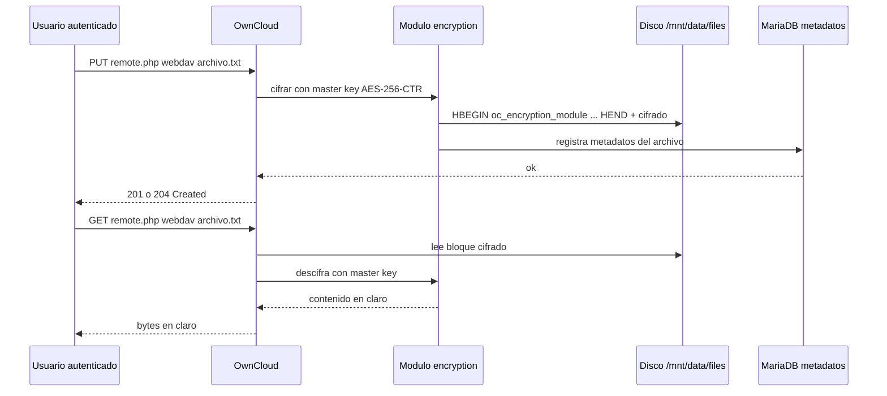
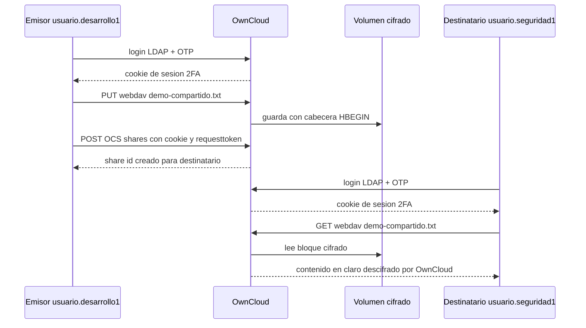

# Memoria técnica

Este capítulo describe paso a paso la implementación del laboratorio. Cada sección referencia los archivos del repositorio público que la materializan y, donde aplica, el script que la valida automáticamente.

## 1. Estructura del repositorio

El repositorio está organizado por componente:

```
otp-secured-cloud/
|-- compose/              docker-compose.yml con todos los servicios
|-- ldap/bootstrap/       LDIFs que siembran el directorio en el primer arranque
|-- privacyidea/          Imagen propia, entrypoint y plantillas de configuración
|-- owncloud/             Hooks del contenedor (registro de la CA local)
|-- caddy/                Caddyfile que termina TLS delante de OwnCloud
|-- certs/                Certificados generados por la CA del proyecto
|-- scripts/              Configuración y verificación reproducibles
|-- docs/                 Memoria técnica, diagramas, conceptos y bitácoras
|-- .env, .env.example    Variables del entorno
`-- README.md             Aviso académico de seguridad y arranque rápido
```

Las contraseñas viven en `.env` con el patrón memorable `sia-<rol>-2026`. Se versionan a propósito por las razones expuestas en el README (sección Aviso académico de seguridad).

## 2. Levantamiento del stack

La validación principal se reproduce con esta secuencia desde la raíz del repositorio:

```bash
./scripts/generate-certs.sh
docker compose -f compose/docker-compose.yml --env-file .env up -d
./scripts/ldap-verify.sh
./scripts/privacyidea-configure.sh && ./scripts/privacyidea-verify.sh
./scripts/owncloud-configure.sh && ./scripts/owncloud-verify.sh
./scripts/owncloud-login-verify.sh usuario.desarrollo1
./scripts/owncloud-share-verify.sh usuario.desarrollo1 usuario.seguridad1
```

Opcional (complemento académico no evaluable, ver sección 8):

```bash
./scripts/audit-capture.sh
```

Los scripts son idempotentes: pueden ejecutarse N veces sin romper el estado. La salida `Todo OK` (o `OK` por bloque, según el script) es la condición de éxito.

## 3. Identificación: OpenLDAP

Ver detalles de diseño en `docs/arbol-ldap.md`.

### Decisiones clave

- Imagen `osixia/openldap:1.5.0`, que empaqueta `slapd` con utilidades de bootstrap y montaje en limpio del LDIF inicial.
- Base DN del proyecto: `dc=sia,dc=unam,dc=mx`. Mapea el contexto académico (UNAM, FI, asignatura SIA) y permite expansión jerárquica.
- Tres OUs principales: `ou=Usuarios` agrupa identidades humanas con sub-OUs `Desarrollo` y `Seguridad`; `ou=Servicios` agrupa cuentas no humanas (NHI). Esa separación permite que el filtro `(objectClass=inetOrgPerson)` devuelva exactamente 6 humanos sin contaminarse con cuentas de servicio.
- Cuenta de servicio `cn=svc-owncloud,ou=Servicios,dc=sia,dc=unam,dc=mx` con `objectClass: simpleSecurityObject + organizationalRole + top`. Sirve para que OwnCloud y privacyIDEA hagan bind y lean el árbol sin usar `cn=admin`.
- ACL específica: la cuenta de servicio tiene lectura de los usuarios y de los atributos relevantes, pero no puede leer `userPassword`.
- TLS habilitado con la CA del proyecto, exponiendo LDAPS en `localhost:6636 -> 636/contenedor`. El puerto plano `389` se mantiene durante la transición y para que `ldapwhoami` desde dentro del contenedor siga siendo trivial.

### Archivos relevantes

- `compose/docker-compose.yml`: servicio `openldap`.
- `ldap/bootstrap/01-base-structure.ldif`: define raíz, OUs y la cuenta de servicio.
- `ldap/bootstrap/02-users-desarrollo.ldif`, `03-users-seguridad.ldif`: siembran 6 usuarios.
- `ldap/bootstrap/04-acls.ldif`: ACL específica para la cuenta de servicio.
- `scripts/ldap-verify.sh`: 8 checks que confirman admin bind, conteo de usuarios humanos exactamente 6, ACL operativa, rechazo de credenciales inválidas y validación de la cadena de TLS LDAPS.

### Qué prueba el verify

1. Admin bind contra `dc=sia,dc=unam,dc=mx`.
2. Listado de usuarios de `ou=Desarrollo`.
3. Listado de usuarios de `ou=Seguridad`.
4. Filtro `(objectClass=inetOrgPerson)` retorna 6 (no contamina con la cuenta de servicio).
5. Bind con la cuenta de servicio `svc-owncloud`.
6. Lectura de los 6 usuarios desde la cuenta de servicio.
7. Bind con contraseña incorrecta es rechazado.
8. LDAPS en `6636` con la CA local.

## 4. Autenticación primer factor: contraseña LDAP

El primer factor se valida durante el login web de OwnCloud. La aplicación hace bind contra LDAP con el DN del usuario y la contraseña enviada en el formulario. Si la cadena de bind falla, OwnCloud rechaza el login sin pasar al segundo factor.

Esto se prueba con `scripts/owncloud-login-verify.sh`, que primero ejecuta `POST /login` con usuario y contraseña LDAP y verifica que la respuesta sea `303 See Other` con `location: /login/selectchallenge` (lo cual implica que el primer factor pasó pero falta segundo factor).

## 5. Autenticación segundo factor: privacyIDEA y FreeOTP

Ver detalles de configuración en `privacyidea/README.md`.

### Decisiones clave

- privacyIDEA `3.10.2` como servidor de tokens, en una imagen propia construida con `Dockerfile` para fijar la versión del paquete Python y reproducir el bootstrap. El `entrypoint.sh` crea las llaves criptográficas, la base SQLite y el admin inicial idempotentemente.
- HTTPS sobre `8443` con el cert `privacyidea.crt` firmado por la CA local.
- Resolver LDAP `sia-ldap` que apunta a `ldaps://openldap:636` y valida contra la CA del proyecto.
- Realm `sia` que agrupa al resolver y se marca como realm por defecto para que las consultas sin realm explícito lo resuelvan.

### Archivos relevantes

- `privacyidea/Dockerfile`, `privacyidea/entrypoint.sh`, `privacyidea/pi.cfg.template`.
- `compose/docker-compose.yml`: servicio `privacyidea`.
- `scripts/privacyidea-configure.sh`: crea/actualiza el resolver y el realm con la API.
- `scripts/privacyidea-verify.sh`: 6 checks (servicio responde, admin bind, resolver, conteo de 6 usuarios, realm).
- `scripts/privacyidea-enroll-test-token.sh`: enrola un TOTP con `genkey=1`, imprime la URL `otpauth://` para FreeOTP y valida el código localmente con Python contra `/validate/check`.
- `scripts/privacyidea-validate-otp.sh`: valida un OTP arbitrario contra el endpoint que usa OwnCloud.

### Cómo se enrola un token para un usuario humano (con FreeOTP)

1. Ejecutar `./scripts/privacyidea-enroll-test-token.sh usuario.desarrollo1`. El script imprime una URL `otpauth://totp/...?secret=...`.
2. Abrir FreeOTP en el teléfono. Tocar el botón "+" (agregar token).
3. Escanear el QR generado por la URL anterior (puede usarse `qrencode` o un visor en línea como `qr-code-generator.com`, o convertirse a QR con cualquier app de escritorio). Alternativamente, FreeOTP acepta entrada manual del secreto (el valor `secret=` de la URL).
4. FreeOTP empieza a generar un código de 6 dígitos cada 30 segundos.
5. El primer código que el dispositivo genere se valida con `./scripts/privacyidea-validate-otp.sh usuario.desarrollo1 <codigo>` para confirmar que el token quedó sincronizado.

## 6. OwnCloud y orquestación 2FA

### Decisiones clave

- OwnCloud Server `10.15.3` (Community Edition).
- MariaDB `10.11` como base de datos. Redis `7-alpine` como caché.
- Caddy `2-alpine` como terminador TLS, con el cert `owncloud.crt` (SANs: `owncloud`, `owncloud-server`, `owncloud-proxy`, `localhost`, `127.0.0.1`, `::1`). Publica el portal en `https://localhost:9443`.
- Backend de usuarios LDAP a través del app `user_ldap`, configurado por `occ ldap:create-empty-config` y `occ ldap:set-config`. Conexión en LDAPS contra `openldap:636`.
- Plugin `twofactor_privacyidea` configurado para apuntar a `https://privacyidea:8443` (interno) usando la CA local.
- Cifrado del lado servidor con módulo por defecto `OC_DEFAULT_MODULE` y `master key` habilitado. Los archivos quedan cifrados en disco (cabecera `HBEGIN:oc_encryption_module:OC_DEFAULT_MODULE:cipher:AES-256-CTR:HEND`).

### Archivos relevantes

- `compose/docker-compose.yml`: servicios `owncloud-server`, `owncloud-db`, `owncloud-redis`, `owncloud-proxy`.
- `caddy/Caddyfile`: configuración del terminador TLS.
- `owncloud/10-trust-project-ca.sh`: hook que registra la CA local en el trust store del contenedor antes del arranque.
- `scripts/owncloud-configure.sh`: aplica `user_ldap`, `twofactor_privacyidea`, encryption y sincroniza usuarios.
- `scripts/owncloud-verify.sh`: 6 checks (HTTPS, instalación, LDAP, 6 usuarios, plugin 2FA, encryption).
- `scripts/owncloud-login-verify.sh`: end-to-end que reproduce el login web LDAP + OTP, sube un archivo por WebDAV y verifica que queda cifrado en disco.

### Figura 5: Flujo de cifrado del lado servidor



## 7. Carpetas compartidas y cifrado del lado destinatario

El profesor pidió validar que el cifrado de archivos compartidos no rompe la lectura del destinatario. El script `scripts/owncloud-share-verify.sh` automatiza ese flujo:

1. Enrolar TOTP para emisor y destinatario en privacyIDEA.
2. Login web LDAP + OTP del emisor.
3. Subir un archivo por WebDAV.
4. Crear el share por OCS Sharing API (POST a `/ocs/v1.php/apps/files_sharing/api/v1/shares` con cookies y `requesttoken` porque la 2FA bloquea Basic Auth).
5. Verificar que el archivo en disco tiene cabecera `HBEGIN:oc_encryption_module`.
6. Login web LDAP + OTP del destinatario.
7. Descargar el archivo por WebDAV desde la cuenta del destinatario y comparar el contenido con el original.

La salida `OK: <destinatario> descifró y leyó el archivo compartido` cierra la última pieza de las fases 5 y 6 del plan original.

### Figura 6: Flujo de carpetas compartidas



## 8. Auditoría (complemento académico, no evaluable)

El profesor confirmó por correo que esta capa no será revisada en la evaluación. Se mantiene en la memoria técnica porque el propio profesor presentó en clase el marco de control de acceso de cuatro capas y omitirla dejaría incompleta la descripción.

Ver `docs/auditoria.md` para los extractos reales de logs.

El script `scripts/audit-capture.sh`:

1. Sube `loglevel` de OwnCloud a `0` (debug) durante la captura para que registre el flujo de `twofactor_privacyidea`, WebDAV y cifrado. Lo restaura a `1` (info) al finalizar.
2. Dispara 8 eventos en orden: login LDAP exitoso, login LDAP fallido, enrolamiento de TOTP, OTP correcto validado, OTP incorrecto rechazado, login web LDAP+OTP exitoso, login web con OTP rechazado, acceso a archivo por WebDAV.
3. Para cada evento, marca un timestamp UTC, dispara la acción y captura líneas relevantes del log de cada componente filtrando por usuario y por timestamp posterior al marcador.
4. Escribe `docs/auditoria.md` con un encabezado por evento, la fuente del log y el extracto en bloques `code`.

El resultado del último ejecutar contiene evidencia de las tres capas evaluables más el complemento de auditoría:

| Capa | Evidencia | Evaluable |
|---|---|---|
| Identificación | OpenLDAP registra el `BIND dn="uid=usuario.desarrollo2,ou=Desarrollo,..."` | Sí |
| Autenticación primer factor | OpenLDAP registra `RESULT err=0` (éxito) o `err=49` (rechazo) | Sí |
| Autenticación segundo factor | OwnCloud registra `"Send request to validate/check"` y la respuesta `{"authentication":"ACCEPT"|"REJECT"}` desde privacyIDEA | Sí |
| Autorización | OwnCloud registra el WebDAV PUT/GET con `"user":"usuario.desarrolloN"`; permisos por carpeta y OCS Sharing | Sí |
| Auditoría | Los logs anteriores son exactamente la cuarta capa: registro de actividad consultable a posteriori | No (complemento) |

## 9. Reproducibilidad

Si se borran los volúmenes (`docker compose down -v`) el entorno se reconstruye exactamente igual ejecutando la secuencia indicada en la sección 2. La memoria técnica completa cabe en este flujo: cualquier integrante o evaluador puede partir de cero y, en menos de 10 minutos en una laptop moderna con Docker, llegar al mismo estado funcional que validan los scripts.
